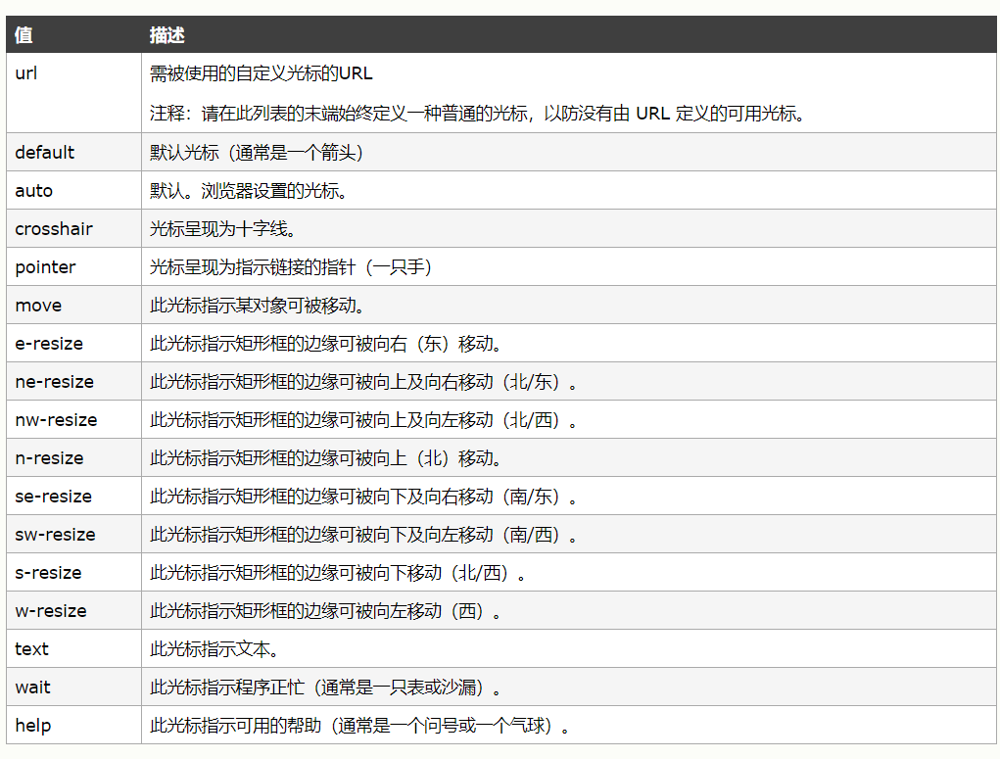

# PROJECT  
## Come From  
这里是滕达的project文件夹，存放看百度前端学院教程的成果  

## Daily  
### Day 1  
day1的内容我选择使用parcel来简单构建一个开发环境  
随后我按照parcel的文档写了一个quickstart详见qstart文件夹  
测试了一下简单的html格式和js格式  
最后把quickstart解析到了pj.tenderkun.com  

PS：parcel官方文档中有一句console.log('hello world')略有小错，我改成了双引号再加了一个分号。  

### Day 2  
今天找着mdn教程上打了一个简单的列表消息盒子样式。  
今天的学习成果：  
1、可以通过`info-box ul`类似的样式来为style为`.info-box`的各个子标签设置style  
2、通过 `document.querySelectorAll`函数可以获取所有指定的html元素  
3、javascript中的有关Attribute函数可以设置元素是否active  

### Day 3  
(文件存储在/定位MDNExample)
学习记录：  
1、style中的cursor规定显示的指针类型
(这里测试在markdown中插入图片的方法)  
  
(似乎在github的markdown里面写base64编码并不合适，但将转换python程序附在当前目录)  

2、  
`<label for="toggle">❔</label><input type="checkbox" id="toggle">`
可以像如上的方式用for来将label和input绑定来实现将label的点击事件同步到CheckBox中。  

3、  
`label[for="toggle"] `  
可以像如上的方式为含有指定for的元素赋予style  
`input[type="checkbox"]`  
type也是同理  

4、  
一个选择方式
`input[type=checkbox]:checked + aside`
上句的选择方式是 选择的checkbox相邻的aside元素

成果:  
实现了checkbox hack  
实现了一个不用JavaScript的可唤出侧边栏（太真实了，从来没想到过）  
