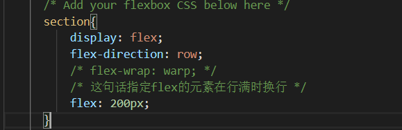
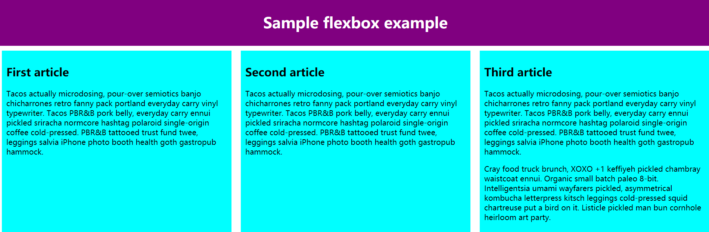
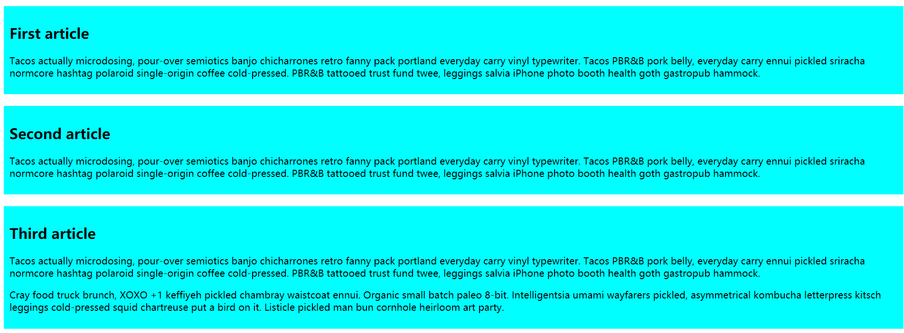

# PROJECT  
## Come From  
这里是滕达的project文件夹，存放看百度前端学院教程的成果  

## Daily  
### Day 1  
day1的内容我选择使用parcel来简单构建一个开发环境  
随后我按照parcel的文档写了一个quickstart详见qstart文件夹  
测试了一下简单的html格式和js格式  
最后把quickstart解析到了pj.tenderkun.com  

PS：parcel官方文档中有一句console.log('hello world')略有小错，我改成了双引号再加了一个分号。  

### Day 2  
今天找着mdn教程上打了一个简单的列表消息盒子样式。  
今天的学习成果：  
1、可以通过`info-box ul`类似的样式来为style为`.info-box`的各个子标签设置style  
2、通过 `document.querySelectorAll`函数可以获取所有指定的html元素  
3、javascript中的有关Attribute函数可以设置元素是否active  

### Day 3  
(文件存储在/定位MDNExample)
学习记录：  
1、style中的cursor规定显示的指针类型
(这里测试在markdown中插入图片的方法)  
  
(似乎在github的markdown里面写base64编码并不合适，但将转换python程序附在当前目录)  

2、  
`<label for="toggle">❔</label><input type="checkbox" id="toggle">`
可以像如上的方式用for来将label和input绑定来实现将label的点击事件同步到CheckBox中。  

3、  
`label[for="toggle"] `  
可以像如上的方式为含有指定for的元素赋予style  
`input[type="checkbox"]`  
type也是同理  

4、  
一个选择方式
`input[type=checkbox]:checked + aside`
上句的选择方式是 选择的checkbox相邻的aside元素

成果:  
实现了checkbox hack  
实现了一个不用JavaScript的可唤出侧边栏（太真实了，从来没想到过）  


### Day 4  
今天内容：弹性盒子
[找的辅助资料](https://www.cnblogs.com/cblx/p/8976309.html)  
[还有一个超好的资料](http://zh.learnlayout.com/display.html)  

笔记：  
1、  (勘误，这里应该是wrap，打错了QAQ)  
上图注释掉的`flex-wrap: wrap;`语句在这个example中有一个意想不到的效果  
当该语句不存在时  
  
我们看到了预想中的效果，这里几个框自适应到了一行三个  
当该语句存在时  
  
这里的框反而好像按列排列，这是因为当指定换行后，我们却没有指定框的左右长度，所以不会有例子1中的自适应的效果，几个框虽然是按照行排列，
但是每行只有1个，所以和列排列的样式相同。
2、  
可以将一个元素的display设置为none来使它隐藏，与visibility设置为hidden不同的是，display为none的元素不会占用位置。  
3、  
max-width属性可以适配小窗口而不会超出最大范围而显示一个滚动条  
4、  
```css
* {
  -webkit-box-sizing: border-box;
     -moz-box-sizing: border-box;
          box-sizing: border-box;
}
```
将上面的代码写入style可以保证所有的盒类元素都可以不用计算padding和border-width来写width和margin  
5、  

这是一个放着position的几个属性各是干嘛的。  
clear属性用来控制浮动（float），它的作用是使下面的dom元素可以清楚上面的dom元素的浮动效果（不受影响）。  
6、`overflow: auto;  `
将overflow设置成auto可以防止内部的浮动元素超出外部dom的范围。  
7、媒体查询  
```css
@media screen and (min-width:600px) {
  nav {
    float: left;
    width: 25%;
  }
  section {
    margin-left: 25%;
  }
}
@media screen and (max-width:599px) {
  nav li {
    display: inline;
  }
}
```  
上面的代码的作用是对于页面宽度在600及以上或者是600一下适用于不同的布局。  
7、针对移动设备还有一个知识点：  
`<meta name="viewport" content="width=device-width, initial-scale=1.0, maximum-scale=1.0, user-scalable=0">`  
这句话会将移动浏览器的viewport固定为设备的宽度

（下面试一下写一个markdown表格）

|属性值|作用|
|------|--|
|width|设置layout viewport  的宽度，为一个正整数，或字符串"width-device"|
|initial-scale|设置页面的初始缩放值，为一个数字，可以带小数|
|minimum-scale|允许用户的最小缩放值，为一个数字，可以带小数|
|maximum-scale|允许用户的最大缩放值，为一个数字，可以带小数|
|height|设置layout viewport  的高度，这个属性对我们并不重要，很少使用|
|user-scalable|是否允许用户进行缩放，值为"no"或"yes", no 代表不允许，yes代表允许|
  
### Day 5  
今天有点小摸，看了一下布局，然后写了一下以后要写的简历的布局框架，设局大概是一个页眉，下面是两栏布局，左边一栏可以被隐藏右边一栏放具体的介绍
右下角一个返回顶部的小按钮。  
布局设计好之后把回到顶部的js写了一下，但是有点生硬有时间可以加个速度渐变。  
准备一下就可以把这个文件解析一下了。  

### Day 6  
今天学习了一下双飞翼布局。  
文件是DoubleWings.html  
[link](http://www.cnblogs.com/langzs/archive/2013/01/27/taobaoshuangfeiyi.html)

从百度前端学院提供的链接的评论区里面找到的一个教学例子。  
这个布局简单的来说就是一个三栏布局，左右两个附加栏固定长度，中间缩放大小。  
但是教学中将中间栏位的dom放在文档最前面的位置来使重要的元素有限加载。  
仔细一想这样倒是能够提升网络连接不畅时的用户体验，但是左栏元素应该也不会很多，只能说这个布局想的很细致。  

这里用到的第一个技术是使左栏和右栏的margin-left设置为负数，这样这个元素就会和上一行对齐，达到使栏目正确显示在左右的作用。  
这样随后会导致左栏的元素将中间主栏覆盖，所以这里在原先主栏的位置新开一个div来撑开这个父元素达到正确显示中间栏目的效果。  
### Day 9  
过年期间休息了几天之后继续开始。  
今天首先看了一下PS的切图，然后开始做百度前端学院的example。  
做了一个开头发现工作量还是挺大的。

知识点：  
1、可以首先设置text-align为center和margin为auto再覆盖margin-top来达到左右居中并制定与上面元素的间距。
2、可以为了一标签指定多个style，在style中用空格分割即可。
3、后指定的style会覆盖前面的style。  

### Day 10  
今天继续做昨天的页面，完成了signup的布局，这次的问题是想要把signup做的好一点所以用了媒体查询，然后就在浮动这些地方
的知识点实践。  

知识点记录：  
1、设置半透明边框  
`border: 1px solid rgba(255, 255, 255, 0.3);`  
在上面的边框设置中使用rgba来指定颜色，最后的alpha就是透明度。  
2、
设置cursor即可替换鼠标指针。  
3、
设置`background-color: transparent;`即可让背景为透明。  
4、
`vertical-align`可以设置图像垂直对齐。  
5、
一开始用了指定margin>1%的方法来让signup的按钮到下一行。  
但其实不用这么麻烦，设置button按钮为块级元素block，就可以不和input共享一行。  
6、
连上条，之后我想顺便用个方便的方法来指定button居中，直接设置为margin：0 auto就可以了
然后可以指定margin-top来覆盖上外距。  
所以顺便修改了低宽度下的input，试图调整一下元素大小和居中（可以不用人工算margin了）